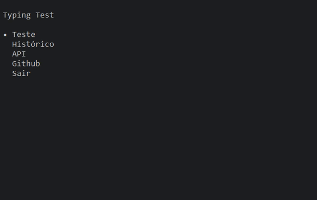

## TypingTest - Teste de Digitação

## `💻` Requisitos
- Python Instalado

### `⚙` Instalação
1. Execute o arquivo `setup.py` **apenas na PRIMEIRA instalação**
2. Execute o arquivo `main.py`

### `❓` Como usar?

- Inicie a aplicação
- Selecione a opção `Teste`
- Selecione o idioma que deseja (**Inglês** e **português** disponíveis)

    

### Histórico

- Mostra o desempenho do usuário e seus testes recentes
    - `Tempo` Tempo levado pelo usuário
    - `PPS` Palavras por segundo
    - `ACC` Precisão do usuário em porcentagem
    - `ERR` Taxa de erro do usuário em porcentagem

- Todos os dados dos Testes são guardados em um arquivo `.json`